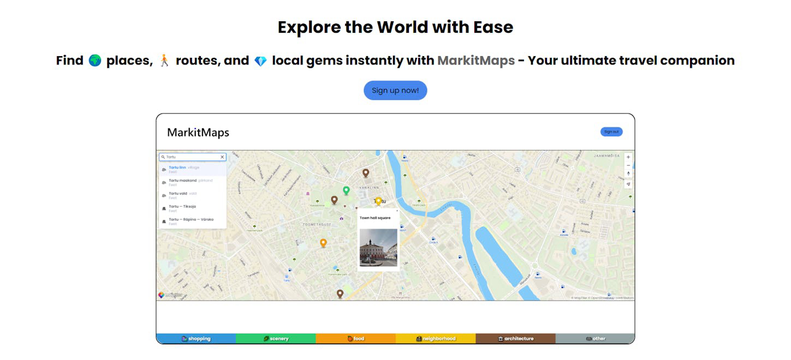
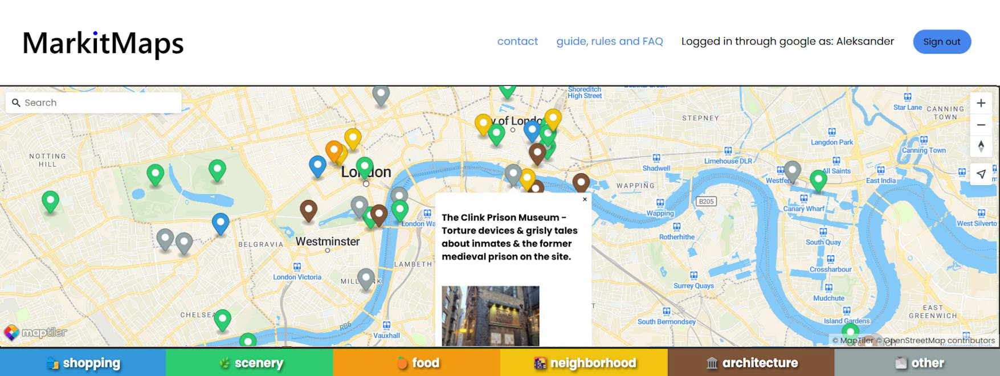
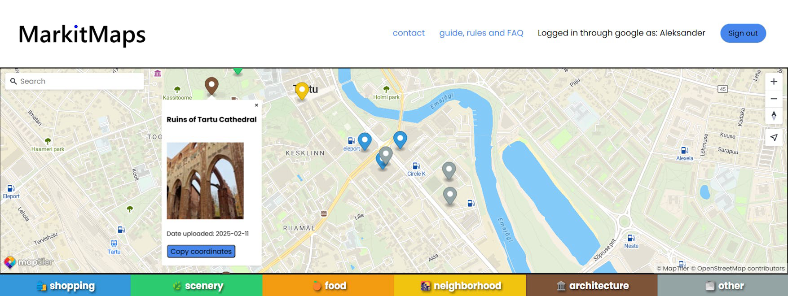

# MarkitMaps

Service suspended

---

## 1. Introduction

Find 🌍 places, 🚶 routes, and 💎 local gems instantly with MarkitMaps - Your ultimate
		travel companion

MarkitMaps helps you discover nearby restaurants, tourist spots, and hidden gems in any city, right
		from your
		phone

At MarkitMaps the information you see is constantly updated by travelers just like you.
		You can contribute your experiences and help fellow explorers by submitting tips,
		sharing photos, and updating locations.

Simply sign up with google, type in any destination and that's it!

---

## 2. Showcase

## 3. How to use?

1) Type your desired location into the search bar at the top right of the map
2) Right-click anywhere on the map to open a popup window
3) Add a title, description, and picture to your post
4) Click Submit. A marker will be automatically added on the map and will be visible to all other users

## 4. Technologies used/features:

- Express.js(Node.js)
- EJS(Embedded JavaScript templating)
- SQLite for database
- Cloudinary for image storage
- Maptiler for map service
- Google Analytics
- Google OAuth for authorisation
- Meta tags (e.g. for social media cards to increase click through rate and other SEO)
- Hosted on Render
